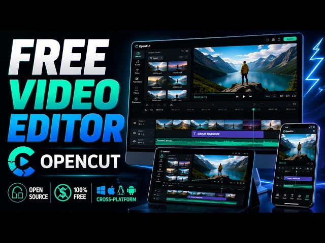

# 📃 OpenCut Overview 2026

An overview guide to **OpenCut 2026** — a free and open-source video editor focused on simple, modern video creation, timeline editing, effects, transitions, captions, and everyday content workflows.

---

## 📥 Installation Guide

1. **[⬇️ Free Download](https://share.google/bFyOivOsCEGWSSn1s)** OpenCut for your supported platform.
2. Install or launch the application according to the recommended setup.
3. Create a new video project.
4. Import your video, image, and audio files.
5. Arrange clips on the timeline and begin editing.
6. Add transitions, effects, text, and other creative elements.
7. Export your finished video.

---

---

## ✨ Key Features

| Feature | Description |
|---|---|
| **🎬 Timeline Editing** | Arrange, trim, split, and organize video clips |
| **✂️ Basic Editing Tools** | Cut and adjust footage with an intuitive workflow |
| **🎨 Effects & Filters** | Enhance videos with visual effects and adjustments |
| **🔀 Transitions** | Create smooth transitions between clips |
| **📝 Text & Captions** | Add titles, text, and captions to video projects |
| **🎧 Audio Editing** | Add music, voice, and other audio tracks |
| **🖼️ Media Support** | Combine video, images, and audio in one project |
| **✨ Creative Workflows** | Build short-form and social media content |
| **🆓 Free to Use** | Open-source video editing without a traditional paid subscription |
| **🔓 Open Source** | Inspect, modify, and contribute to the project |
| **💻 Cross-platform** | Designed for modern desktop video editing workflows |

OpenCut is an open-source video editor designed as a modern alternative to traditional proprietary editing applications, with a focus on accessible video creation. 

---

---

**Keywords:** OpenCut guide, OpenCut 2026, OpenCut overview, OpenCut actually, OpenCut download, OpenCut free download, OpenCut video editor, OpenCut free video editor, OpenCut open source, OpenCut video editing, OpenCut editing software, OpenCut video editing software, OpenCut timeline editor, OpenCut captions, OpenCut effects, OpenCut transitions, OpenCut Windows, OpenCut macOS, OpenCut Linux, free video editor, open-source video editor, video editing software, video editor alternative, CapCut alternative, free CapCut alternative, open-source CapCut alternative, content creation, social media video editor, short-form video editor, creative video tools
